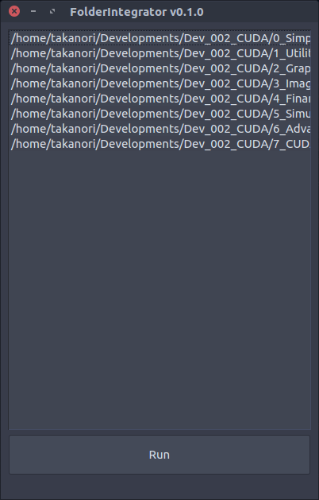

# FolderIntegrator
Tool to integrate multi folders.



# Launch

1. Prepare environment for PySide
2. Go to the repository
3. Run commmand `python gui.py`

# How to use

1. Drag & Drop folders to the window.
2. Push "Run" button.

- To open context menu, right click on the list.
- To clear list, use "Clear" menu on context menu.

# Usage

With terminal command, adding folders as arguments creates single folder and integrate all files from folders into the single folder.

```bash
python core.py [folders]
```

### Before:
```
root_folder
    | - a
    |   |- a-a
    |   |- a-b
    | - b
    |   |- b-a
    |   |- b-b
    |   |- b-c
```

### After:
```
root_folder
    |- 'untitiled'
    |   |- a-a
    |   |- a-b
    |   |- b-a
    |   |- b-b
    |   |- b-c
```

# Credits

- Icon made by [Appzgear](https://www.flaticon.com/authors/appzgear) from www.flaticon.com 
- Icons made by [Smashicons](https://www.flaticon.com/authors/smashicons) from www.flaticon.com is licensed by [CC 3.0 BY](http://creativecommons.org/licenses/by/3.0/)